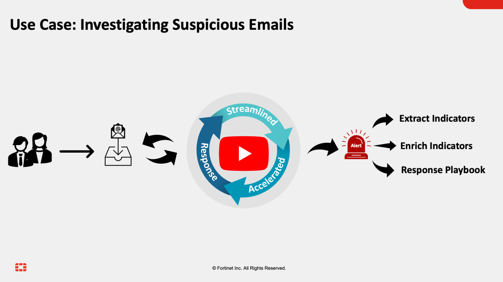

# Release Information

- **Version**:  1.0.1
- **Certified**: Yes
- **Publisher**: Fortinet
- **Compatible Version**: FortiSOAR v7.2.0 and above

# Overview

The **Phishing Email Response** solution pack contains a set of investigation playbooks that help you respond to suspicious emails. It also includes a scenario that generates a demo alert of the type *Suspicious Email* and demonstrates the available actions.

The use-case deals with investigation and containment procedures that come in effect when end-users report a suspicious email by sending it to a designated mailbox in any of the following formats:

- As an attachment in `.msg` format
- As an attachment in `.eml` format
- Inline, as a forwarded email

This solution pack, along with its included playbooks, investigates suspicious emails for:
- **Spoofing** - by checking sender and reply-to address
- **Suspicious terms** - terms like bitcoin, free money, or free membership

Moreover, you can manually upload emails in `.eml` or `.msg` format for investigation and enrichment of indicators.

Following is a demonstration video on how to use Phishing Email Response solution pack:

**Video: Using Phishing Response Solution Pack**

# Next Steps

| [Installation](./docs/setup.md#installation) | [Configuration](./docs/setup.md#configuration) | [Usage](./docs/usage.md) | [Contents](./docs/contents.md) |
|----------------------------------------------|------------------------------------------------|--------------------------|--------------------------------|