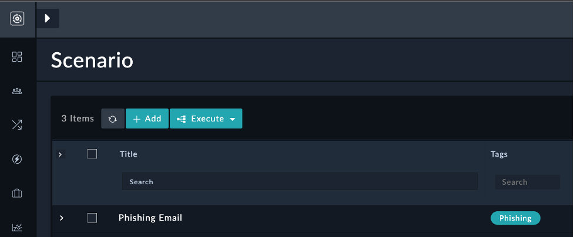
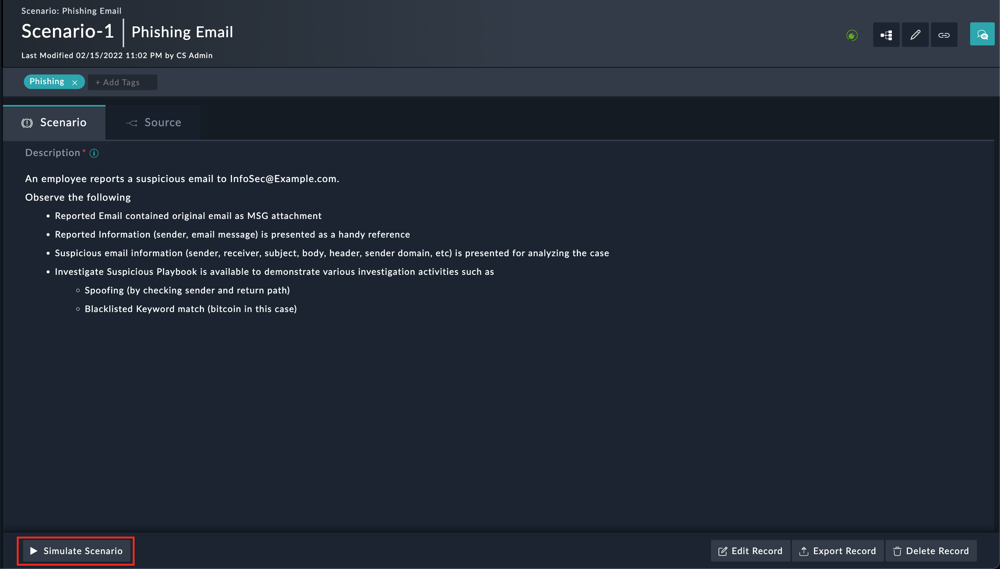
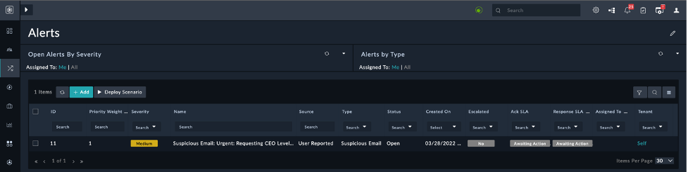
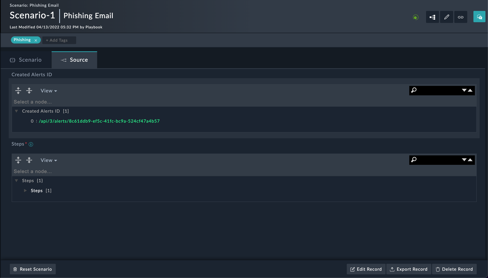

# Usage Phishing Email Response Solution Pack
## Use Case Workflow
This solution pack contains two types of execution workflows
- Scenario-based Workflow
- Investigate Suspicious Email

## Scenario-based Workflow
The scenario demonstrates and generates a demo alert for the Alert Type ' Suspicious Email'.

Please refer to the below step to execute scenarios
1.	Go to the ‘Simulations’ menu in Navigation and choose “Phishing Email” scenario”.
      
2. Open a “Phishing Email” scenario and Click on ‘Simulate Scenario’ button.
     
3. Check demo Alert record “Suspicious Email: Urgent: Requesting CEO Level Demo Environment” is created for the scenario in Alert module.
     
4. The created Alerts records IRI will be mapped in the Scenario record detail view under the Source tab.
    

## Investigate Suspicious Email Playbook Workflow
Please refer to the below step to execute the use-case
1.	Open the “Suspicious Email: Urgent: Requesting CEO Level Demo Environment” alert in detail view, click on the execute button to execute the “Investigate Suspicious Email” usecase.
    